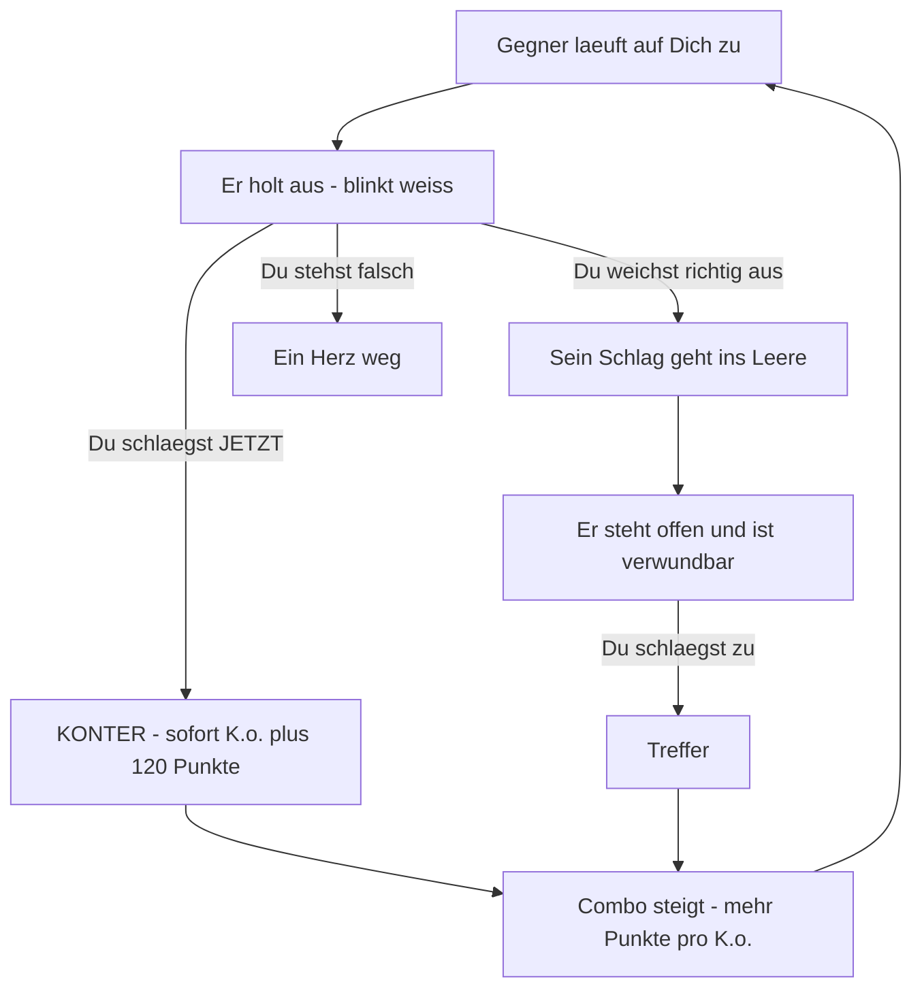

# NACHTSCHICHT

*Party Game drunk.*

Ein Pixel-Art-Arcade-Brawler im Browser. Du gehst durch eine Nacht, sammelst
Shots, schlägst Dich durch und musst an vier Bossen vorbei. Eine einzige
HTML-Datei — kein Download, keine Installation, kein Konto.

---

## In 30 Sekunden verstanden

Drei Dinge, dann kannst Du spielen:

**1. Nichts bewegt sich ohne Dich.** Kein Auto-Lauf. Du gehst selbst, in Deinem
Tempo, mit `A` und `D`.

**2. Von links kommt die Sperrstunde.** Eine schwarze Wand mit leuchtender Kante
und greifenden Händen. Berührt sie Dich, ist sofort Schluss — Herzen helfen
nicht. Sie wird schneller, wenn Du stehen bleibst. Am Anfang hast Du rund
13 Sekunden Standzeit, später deutlich weniger.

**3. Gegner kündigen jeden Angriff an.** Sie blinken weiß und ein Ausrufezeichen
erscheint. Die **Farbe** sagt Dir, was zu tun ist:

| Farbe | Angriff | Deine Antwort |
|:--|:--|:--|
| 🔵 Blau | Schlag auf Kopfhöhe | **Ducken** |
| 🟡 Gelb | Fegen am Boden | **Springen** |
| 🔴 Rot | Trifft alles | **Zurückweichen** |

Und die wichtigste Regel: **schlägst Du zu, während er ausholt, ist das ein
Konter** — er geht sofort um, egal wie viel Leben er hat.

---

## Steuerung

| Taste | Aktion |
|:--|:--|
| `A` `D` oder `←` `→` | Laufen |
| `Leertaste` `W` `↑` | Springen — kurz antippen ergibt einen kleinen Hüpfer |
| `S` `↓` | Ducken |
| **`E`** | Schlagen (auch `X`, `J`, `Shift`) |
| `F` | Vollbild |
| `P` | Pause |
| `M` | Ton aus |

**Am Handy** läuft es im Querformat. Links unten die Pfeile zum Laufen, rechts
unten Schlag und Sprung, darüber Ducken. Die erste Berührung schaltet ins
Vollbild. Hältst Du das Handy hochkant, kommt ein Hinweis zum Drehen.

---

## Der Kampf

Das ist der Kern des Spiels. Jeder Gegner läuft einen festen Zyklus, und in
jeder Phase hast Du eine andere Möglichkeit:



Der Konter ist der Unterschied zwischen Draufhauen und gut Spielen. Wer nur
wartet, bis der Gegner offen steht, kommt durch. Wer im richtigen Moment
zuschlägt, kommt schneller durch und macht mehr Punkte.

Ein Detail, das oft übersehen wird: **Du kannst über Gegner springen.** Wenn die
Sperrstunde im Nacken sitzt, ist das oft klüger, als jeden Kampf anzunehmen.

### Wen Du triffst

| Typ | Aushalten | Verhalten |
|:--|:--|:--|
| **Gegner** | 1 Schlag | Standard. Holt auf Kopfhöhe aus |
| **Brocken** | 2 Schläge | Gepanzert, **nicht konterbar**. Roter Balken über dem Kopf. Trifft alles — hier hilft nur Zurückweichen |
| **Flitzer** | 1 Schlag | Schnell, fegt am Boden. Drüberspringen |
| **Werfer** | 1 Schlag | Bleibt auf Distanz und wirft Flaschen. Musst Du stellen |
| **Taube** | 1 Schlag | Fliegt auf Kopfhöhe durch |

Sie kommen oft in Gruppen zu zweit oder dritt. Wer einen umhaut, reißt den
nächsten dahinter gleich mit um.

---

## Der Pegel

Jeder Shot bringt Punkte und treibt den Pegel hoch. Ein hoher Pegel gibt bis zu
**dreifache Punkte** — kostet aber Kontrolle:

- das Bild fängt an zu wackeln
- die Steuerung wird träge, Deine Eingaben kommen verzögert an
- der Blick verengt sich
- die Farben beginnen zu bluten

Bei 100 % ist **Blackout** und der Lauf vorbei, egal wie viele Herzen Du noch
hast. Nüchtern wirst Du praktisch nur durch Wasser — von allein passiert fast
nichts.

Das ist die Risiko-Belohnungs-Schraube des Spiels: Wie gierig bist Du?

---

## Die Sperrstunde

Sie ist der Taktgeber. Wie lange Du an einer Stelle stehen bleiben darfst, hängt
davon ab, wie weit Du schon gekommen bist:

| Strecke | Standzeit |
|:--|:--|
| Start | ~13 Sekunden |
| 1000 m | ~9 Sekunden |
| 3000 m | ~6 Sekunden |
| 5000 m | ~4,5 Sekunden |

Am Anfang reicht das locker, um eine Dreiergruppe zu verprügeln. Später musst Du
auswählen, welche Kämpfe Du überhaupt annimmst. **Im Bosskampf steht sie still** —
der Kampf soll fair sein.

---

## Die Bosse

Vier Stück, jeder mit festen Mustern und angekündigten Angriffen:

| Angriff | Was passiert | Was Du tust |
|:--|:--|:--|
| **Sturmangriff** | Er stürmt auf Dich zu | Wegducken. Danach steht er offen — **das ist Dein Konterfenster** |
| **Flaschen** | Wurfgeschosse im Bogen | Drüberspringen |
| **Handlanger** | Kommen hoch und tief zugleich | Umhauen oder ausweichen |

Ab zwei Dritteln Restleben wechselt er in Phase 2, ab einem Drittel in Phase 3.
Jede Phase ist schneller und mischt die Muster anders. Die Schwierigkeit steigt
über die vier Bosse hinweg:

| Boss | Leben | Vorwarnzeit |
|:--|:--:|:--|
| Der Türsteher | 4 | am längsten — er ist die Lehrstunde |
| Die Meute | 5 | etwas kürzer |
| Die Müdigkeit | 6 | normal |
| Die Sonne | 7 | am kürzesten |

---

## Etappen

**Vorglühen → Türsteher → Club → Afterhour → Heimweg.** Jede Etappe hat eigene
Farben, eigenen Boss und teilweise Regen. Danach geht es endlos weiter, und die
Sperrstunde wird immer schneller.

---

## Ein paar Tipps

- **Konter schlagen Geduld.** Auf das offene Fenster warten funktioniert, aber
  kostet Zeit, die Du gegen die Sperrstunde nicht hast.
- **Nicht jeden Kampf annehmen.** Springen ist manchmal die bessere Antwort.
- **Wasser ist wertvoller, als es aussieht.** Es ist Dein einziger Weg zurück.
- **Brocken nicht kontern wollen.** Sie sind gepanzert. Zurückweichen, dann
  zweimal zuschlagen.
- **Der Pegel lohnt sich** — aber plane ein, dass Deine Steuerung träger wird.

---

## Selbst dran drehen

Ganz oben in `index.html` steht ein Block namens `TUNE`. Dort liegt das komplette
Spielgefühl in benannten Werten: Tempo, Sprunghöhe, wie hart der Pegel bestraft,
wie schnell die Sperrstunde nachrückt, wie viel Leben die Bosse haben, wie oft
was kommt. Die Spiellogik selbst enthält keine festen Zahlen, sie fragt nur
diesen Block ab — ein anderer Wert dort verändert das ganze Spiel, ohne dass eine
Zeile Logik angefasst werden muss.

Ein paar Beispiele:

| Regler | Bewirkt |
|:--|:--|
| `leben: 1` | Sofort-Tod statt drei Herzen. Die brutale Variante |
| `lineSpeed` | Wie schnell die Sperrstunde grundsätzlich nachrückt |
| `chanceEnemy` | Anteil Gegner gegenüber toten Hindernissen |
| `konterFenster` | `1` = das ganze Ausholen zählt, `0.5` = nur die zweite Hälfte |
| `pegelDecayPerSec` | Wie schnell man von allein ausnüchtert |

Die Sprüche stehen direkt darunter in `SAY`, nach Anlass sortiert. Einfach Zeilen
dazuschreiben — sie werden zufällig gezogen.

---

## Lokal starten

Doppelklick auf `index.html` reicht. Wer lieber einen Server will:

```bash
python -m http.server 5173
```

Dann `http://localhost:5173` aufrufen. Mit `?touch=1` an der Adresse lässt sich
die Handy-Steuerung am Rechner testen.

---

## Technisch

- 320 × 180 interne Auflösung, ganzzahlig hochskaliert, CRT-Overlay mit
  Scanlines und Vignette
- Eigener 3×5-Bitmap-Font statt Browser-Schrift
- Vier Parallax-Ebenen, nach Helligkeit gestaffelt statt nur nach Geschwindigkeit
- Chiptune-Sequencer über WebAudio, eigene Bassline im Bosskampf
- Sprites, Konturen, Schrift und Farbverläufe werden einmal auf eigene Leinwände
  gebacken und danach nur noch kopiert — das drückt die Zeichenzeit von 4,8 ms
  auf 1,2 ms pro Bild
- Sämtliches Timing läuft in Spielzeit statt Wanduhrzeit, damit Pause und
  Frame-Aussetzer das Kampf-Timing nicht zerlegen

---

## Fotos

Der Ordner `fotos/` ist absichtlich aus der Versionsverwaltung ausgeschlossen.
Dieses Repo ist öffentlich, damit GitHub Pages funktioniert — Bilder von echten
Personen haben darin nichts verloren. Aus den Fotos entstehen später
Pixel-Sprites, und nur die landen im Code.

---

## Woran es sich orientiert

- **HerrAnwalt: Lawyers Legacy** (YGameStudios) — Pixel-Art-Action-Platformer mit
  Story- und Endlosmodus, bei dem man springt *und* schlägt
- **Crossy Road** — die nachrückende Bedrohung, die einen zwingt weiterzugehen
- Gängige Bosskampf-Praxis: erkennbare Angriffsmuster, jeder Angriff wird
  telegrafiert, mehrere Phasen, klare Silhouette, markierte Schwachstelle

---

## Stand

Prototyp v0.7. Was noch fehlt: Plattformen zum Draufspringen, die echten
Gesichter der Crew, Charakterwahl mit unterschiedlichen Fähigkeiten,
ein richtiges Ende.
